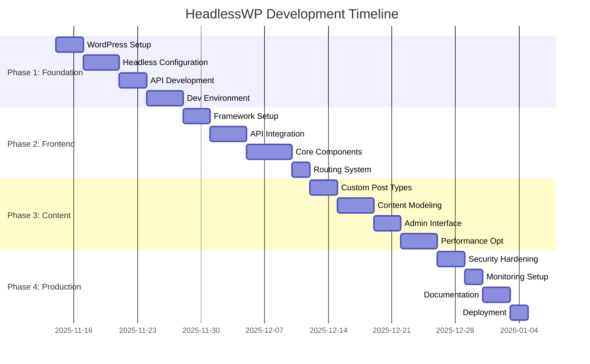

# 🗺️ HeadlessWP Project Roadmap

## 📋 Executive Summary
This roadmap outlines the strategic plan for developing a headless WordPress solution for mitrabantennews.com. The project spans 8 weeks across 4 phases, focusing on delivering a robust, scalable, and maintainable headless CMS architecture.

## 🎯 Project Vision
Transform mitrabantennews.com into a modern, performant headless WordPress application that provides:
- **Blazing-fast page loads** through modern frontend frameworks
- **Enhanced developer experience** with modern tooling
- **Scalable architecture** for future growth
- **Improved content management** workflow
- **Better SEO and performance** metrics

## 📅 Timeline Overview

## 🚀 Phase 1: Foundation (Week 1-2)
**Target**: November 14 - November 28, 2025

### 🎯 Objectives
- Establish robust WordPress backend
- Configure headless architecture
- Set up development infrastructure

### 📋 Sprint Breakdown

#### Sprint 1.1: WordPress Core Setup (Days 1-3)
**Tasks**:
- [ ] **WP-001**: WordPress installation & configuration
  - Install WordPress 6.4+
  - Configure basic settings (site title, permalinks, timezone)
  - Setup SSL certificate
  - Configure security headers
- [ ] **WP-002**: Essential plugins installation
  - Install security plugins (Wordfence/Sucuri)
  - Install SEO plugin (Yoast/Rank Math)
  - Install caching plugin (WP Rocket/W3 Total Cache)
  - Install backup solution

**Deliverables**:
- Functional WordPress installation
- Security baseline established
- Plugin configuration documented

#### Sprint 1.2: Headless Architecture (Days 4-7)
**Tasks**:
- [ ] **WP-003**: Headless plugins setup
  - Install and configure WPGraphQL
  - Install and configure REST API extensions
  - Setup CORS configuration
  - Configure authentication (JWT/OAuth)
- [ ] **WP-004**: API endpoint optimization
  - Custom GraphQL schemas
  - REST API endpoint customization
  - Performance optimization
  - Security hardening

**Deliverables**:
- Working GraphQL API
- Secure REST API endpoints
- API documentation

#### Sprint 1.3: Development Environment (Days 8-10)
**Tasks**:
- [ ] **DEV-001**: Local development setup
  - Docker configuration
  - Environment variables management
  - Database setup and migration scripts
  - Development tools configuration
- [ ] **DEV-002**: CI/CD pipeline setup
  - GitHub Actions workflows
  - Testing framework setup
  - Code quality tools
  - Deployment scripts

**Deliverables**:
- Complete development environment
- Automated testing pipeline
- Deployment automation

#### Sprint 1.4: API Testing & Documentation (Days 11-14)
**Tasks**:
- [ ] **API-001**: Comprehensive API testing
  - Unit tests for API endpoints
  - Integration tests
  - Performance testing
  - Security testing
- [ ] **DOC-001**: API documentation
  - GraphQL schema documentation
  - REST API reference
  - Authentication guide
  - Usage examples

**Deliverables**:
- Fully tested API endpoints
- Comprehensive API documentation
- Performance benchmarks

### 🎯 Success Criteria
- [ ] WordPress installation secure and optimized
- [ ] GraphQL API functional and documented
- [ ] REST API endpoints secure and tested
- [ ] Development environment reproducible
- [ ] CI/CD pipeline operational

## 🎨 Phase 2: Frontend Integration (Week 3-4)
**Target**: November 29 - December 12, 2025

### 🎯 Objectives
- Select and setup frontend framework
- Implement API integration layer
- Develop core UI components

### 📋 Sprint Breakdown

#### Sprint 2.1: Framework Selection & Setup (Days 15-17)
**Tasks**:
- [ ] **FE-001**: Framework evaluation and selection
  - Compare React/Next.js vs Vue/Nuxt
  - Performance benchmarking
  - Developer experience assessment
  - Community support evaluation
- [ ] **FE-002**: Project initialization
  - Create frontend project structure
  - Configure build tools
  - Setup development server
  - Configure environment variables

**Deliverables**:
- Framework decision document
- Frontend project scaffold
- Build configuration

#### Sprint 2.2: API Integration Layer (Days 18-21)
**Tasks**:
- [ ] **FE-003**: API client setup
  - GraphQL client configuration (Apollo/urql)
  - REST API client setup
  - Error handling implementation
  - Caching strategy
- [ ] **FE-004**: Data fetching hooks
  - Custom React hooks for data fetching
  - State management integration
  - Loading states handling
  - Error boundary implementation

**Deliverables**:
- Working API integration
- Data fetching utilities
- Error handling system

#### Sprint 2.3: Core Components (Days 22-26)
**Tasks**:
- [ ] **FE-005**: Layout components
  - Header with navigation
  - Footer with links
  - Sidebar components
  - Responsive grid system
- [ ] **FE-006**: Content components
  - Article card component
  - Article list component
  - Category display
  - Tag system
  - Search functionality

**Deliverables**:
- Complete component library
- Responsive design implementation
- Component documentation

#### Sprint 2.4: Routing & Navigation (Days 27-28)
**Tasks**:
- [ ] **FE-007**: Routing implementation
  - Page routing setup
  - Dynamic routes for articles
  - Category and tag pages
  - Search results page
- [ ] **FE-008**: Navigation optimization
  - Breadcrumb navigation
  - Pagination implementation
  - Menu management
  - SEO-friendly URLs

**Deliverables**:
- Complete routing system
- Navigation components
- SEO-optimized URL structure

### 🎯 Success Criteria
- [ ] Frontend framework properly configured
- [ ] API integration working seamlessly
- [ ] Core components developed and tested
- [ ] Routing system functional
- [ ] Mobile-responsive design

## 📝 Phase 3: Content Management (Week 5-6)
**Target**: December 13 - December 26, 2025

### 🎯 Objectives
- Implement custom content types
- Optimize content modeling
- Enhance admin interface

### 📋 Sprint Breakdown

#### Sprint 3.1: Custom Post Types (Days 29-31)
**Tasks**:
- [ ] **CM-001**: News article post type
  - Custom post type registration
  - Custom fields setup (ACF/CMB2)
  - Template hierarchy
  - Permalink structure
- [ ] **CM-002**: Taxonomy setup
  - Category hierarchy
  - Tag system
  - Custom taxonomies
  - Relationship management

**Deliverables**:
- Custom post types configured
- Taxonomy structure implemented
- Content relationships defined

#### Sprint 3.2: Content Modeling (Days 32-35)
**Tasks**:
- [ ] **CM-003**: GraphQL schema design
  - Custom type definitions
  - Field resolvers
  - Query optimization
  - Mutation implementation
- [ ] **CM-004**: Content relationships
  - Article-author relationships
  - Category-article associations
  - Related articles logic
  - Content recommendations

**Deliverables**:
- Optimized GraphQL schema
- Content relationship system
- Query performance improvements

#### Sprint 3.3: Admin Interface (Days 36-38)
**Tasks**:
- [ ] **CM-005**: Custom admin panels
  - Custom dashboard widgets
  - Content overview screens
  - Bulk editing tools
  - Content preview functionality
- [ ] **CM-006**: Workflow optimization
  - Content status management
  - Editorial workflow
  - Review process
  - Publication scheduling

**Deliverables**:
- Enhanced admin interface
- Streamlined content workflow
- Preview functionality

#### Sprint 3.4: Performance Optimization (Days 39-42)
**Tasks**:
- [ ] **PERF-001**: Caching implementation
  - GraphQL query caching
  - REST API caching
  - Object caching setup
  - CDN integration
- [ ] **PERF-002**: Database optimization
  - Query optimization
  - Index optimization
  - Database cleanup
  - Performance monitoring

**Deliverables**:
- Optimized caching strategy
- Improved database performance
- Performance monitoring setup

### 🎯 Success Criteria
- [ ] Custom post types functional
- [ ] Content modeling optimized
- [ ] Admin interface user-friendly
- [ ] Performance benchmarks met

## 🚀 Phase 4: Production Ready (Week 7-8)
**Target**: December 27, 2025 - January 9, 2026

### 🎯 Objectives
- Security hardening
- Production deployment
- Documentation completion

### 📋 Sprint Breakdown

#### Sprint 4.1: Security Hardening (Days 43-45)
**Tasks**:
- [ ] **SEC-001**: Security audit
  - Vulnerability scanning
  - Security headers configuration
  - Access control implementation
  - Rate limiting setup
- [ ] **SEC-002**: Authentication security
  - JWT token security
  - Session management
  - Password policies
  - Two-factor authentication

**Deliverables**:
- Security audit report
- Hardened security configuration
- Security monitoring setup

#### Sprint 4.2: Monitoring & Analytics (Days 46-47)
**Tasks**:
- [ ] **MON-001**: Performance monitoring
  - Application performance monitoring
  - Error tracking setup
  - Uptime monitoring
  - Performance alerts
- [ ] **MON-002**: Analytics integration
  - Google Analytics setup
  - User behavior tracking
  - Content performance metrics
  - SEO monitoring

**Deliverables**:
- Comprehensive monitoring system
- Analytics dashboard
- Alert configuration

#### Sprint 4.3: Documentation (Days 48-50)
**Tasks**:
- [ ] **DOC-002**: Technical documentation
  - Architecture documentation
  - API reference guide
  - Deployment guide
  - Troubleshooting guide
- [ ] **DOC-003**: User documentation
  - Content manager guide
  - Developer onboarding
  - Best practices
  - Maintenance procedures

**Deliverables**:
- Complete technical documentation
- User guides and tutorials
- Maintenance procedures

#### Sprint 4.4: Deployment (Days 51-56)
**Tasks**:
- [ ] **DEP-001**: Production deployment
  - Staging environment setup
  - Production deployment
  - DNS configuration
  - SSL certificate setup
- [ ] **DEP-002**: Post-deployment
  - Performance testing
  - Security validation
  - User acceptance testing
  - Go-live preparation

**Deliverables**:
- Production deployment
- Performance validation
- Launch readiness

### 🎯 Success Criteria
- [ ] Security audit passed
- [ ] Monitoring system operational
- [ ] Documentation complete
- [ ] Production deployment successful
- [ ] Stakeholder approval received

## 📊 Risk Management

### 🔴 High Risk Items
1. **Performance Issues**: Complex GraphQL queries may impact performance
   - **Mitigation**: Implement query optimization and caching
   - **Owner**: Backend Developer
   - **Timeline**: Phase 3

2. **Security Vulnerabilities**: Headless architecture increases attack surface
   - **Mitigation**: Regular security audits and penetration testing
   - **Owner**: Security Lead
   - **Timeline**: Phase 4

### 🟡 Medium Risk Items
1. **Third-party Dependencies**: Plugin conflicts or compatibility issues
   - **Mitigation**: Thorough testing and fallback plans
   - **Owner**: Full-stack Developer
   - **Timeline**: Ongoing

2. **Team Availability**: Resource constraints may impact timeline
   - **Mitigation**: Cross-training and flexible sprint planning
   - **Owner**: Project Manager
   - **Timeline**: Ongoing

## 📈 Success Metrics

### 🎯 Technical Metrics
- **Page Load Time**: < 2 seconds
- **Time to Interactive**: < 3 seconds
- **API Response Time**: < 500ms
- **Uptime**: > 99.9%
- **Security Score**: A+ grade

### 📊 Business Metrics
- **Content Publishing Speed**: 50% faster
- **Developer Productivity**: 30% improvement
- **User Engagement**: 20% increase
- **SEO Rankings**: Top 3 for target keywords
- **Mobile Performance**: 90+ Google PageSpeed score

## 🔄 Continuous Improvement

### 📅 Review Cadence
- **Daily**: Stand-up meetings and progress tracking
- **Weekly**: Sprint reviews and retrospectives
- **Bi-weekly**: Stakeholder updates and roadmap adjustments
- **Monthly**: Performance reviews and process improvements

### 📋 Process Optimization
- **Sprint Planning**: Regular backlog grooming and prioritization
- **Code Quality**: Continuous integration and automated testing
- **Documentation**: Living documents updated regularly
- **Knowledge Sharing**: Regular tech talks and brown bag sessions

## 🎉 Project Completion

### 🏆 Final Deliverables
1. **Production-ready headless WordPress site**
2. **Comprehensive documentation suite**
3. **Automated deployment pipeline**
4. **Performance monitoring dashboard**
5. **Security hardening implementation**

### 📊 Handover Requirements
- [ ] Stakeholder training completed
- [ ] Documentation signed off
- [ ] Support procedures established
- [ ] Maintenance schedule defined
- [ ] Project retrospective conducted

---

**Last Updated**: November 14, 2025
**Next Review**: November 21, 2025
**Project Manager**: GitHub Project Manager
**Repository**: https://github.com/sulhimbn/headlesswp